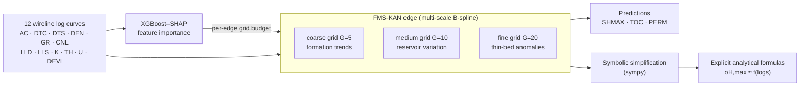

# FMS-KAN for Well-Logging Knowledge Discovery

**A Feature-guided Multi-Scale Kolmogorov–Arnold Network for *interpretable* prediction of in-situ stress and reservoir parameters from wireline logs — models you read as equations, not just query as black boxes.**

[](#project-status)
[](LICENSE)
[](https://www.python.org/)
[](https://pytorch.org/)
[](#data--ethics)
[](#reproduction)

> **What this repo is.** The code and a de-identified 50% data subset for the FMS-KAN paper (under review). It reproduces the modeling pipeline end-to-end and the study's qualitative results. This is a research snapshot, not a production library — see [Project Status](#project-status).

---

## Architecture at a Glance



Two design choices separate FMS-KAN from a standard KAN:

1. **Multi-scale B-spline adaptation** — coarse (*G*=5), medium (*G*=10), and fine (*G*=20) spline resolutions are combined on every edge, so one model captures formation-level trends, reservoir-level variation, and thin-bed anomalies at once.
2. **Feature-guided grid allocation** — XGBoost–SHAP importances set the grid budget per input edge, concentrating network capacity on the physically dominant curves.

Because a KAN is a sum of learned univariate functions, the trained network can be **symbolically simplified into explicit equations** — the property this project exists to demonstrate.

---

## Table of Contents

- [Architecture at a Glance](#architecture-at-a-glance)
- [Key Results](#key-results)
- [Interpretability: A Formula You Can Read](#interpretability-a-formula-you-can-read)
- [Repository Structure](#repository-structure)
- [Installation](#installation)
- [Quickstart](#quickstart)
- [Reproduction](#reproduction)
- [Data & Ethics](#data--ethics)
- [Project Status](#project-status)
- [Contributing & Contact](#contributing--contact)
- [Citation](#citation)
- [Authors](#authors)
- [License](#license)

---

## Key Results

Test-set **R²** on a single pooled 70/15/15 train/validation/test split (`random_state=42`). Every model shares identical features, standardization, and split.

| Target   | Linear | Poly-3 | Random Forest | MLP   | Std. KAN | **FMS-KAN** |
|----------|:------:|:------:|:-------------:|:-----:|:--------:|:-----------:|
| SHMAX    | 0.925  | 0.986  | 0.998         | 0.990 | 0.995    | **0.997**   |
| TOC      | 0.850  | 0.947  | 0.970         | 0.971 | 0.968    | **0.975**   |
| PERM     | < 0    | 0.875  | 0.976         | 0.943 | 0.979    | **0.984**   |
| **Mean** | —      | 0.936  | 0.981         | 0.968 | 0.981    | **0.985**   |

On this pooled split FMS-KAN attains the **highest mean R² (0.985)**; it **leads on TOC and PERM** over every black-box baseline and is **statistically level with the strongest black box (Random Forest) on SHMAX** (0.997 vs. 0.998). Its decisive, consistent margin is over the **traditional** baselines (linear/polynomial). `train_pooled.py` also evaluates Gradient Boosting (GBDT); the table reports the strongest baseline per family, and the full comparison is regenerated by the script (see [Reproduction](#reproduction)).

> **How to read these numbers.** They are point estimates from **one** pooled random split. Well-log samples are spatially and depth-correlated, so a pooled split can be optimistic — treat these values as an *upper-bound* generalization estimate, **not** a leave-one-well-out (LOWO) claim. They carry **no confidence intervals** (single seed, single split). For the geoscience-credible out-of-distribution test, use `train_lowo.py`, which withholds an entire well at a time. Per-target RMSE/MAE in physical units (MPa, wt%, mD) and per-well breakdowns are written to `final_error_table.csv` and `r2_per_well.json` by the pipeline rather than hand-copied here.

**Released-subset sample counts** (rows per well in `data/`; target columns contain depth-dependent gaps):

| Well      |    Rows |
|-----------|--------:|
| Well A    |   1,346 |
| Well B    |   2,106 |
| Well C    |   1,788 |
| Well D    |     572 |
| **Total** | **5,812** |

---

## Interpretability: A Formula You Can Read

The point of FMS-KAN is that a fitted model is not a weight tensor but an **equation**. After pruning and symbolic fitting (`sympy`, invoked in `finalize_pipeline.py`), each target reduces to a compact sum of univariate terms. The SHMAX head takes the form:

```
σH,max  ≈  c0
        +  f_DEN(DEN)          # density → overburden / stress trend
        +  f_AC(AC)            # sonic (compressional slowness)
        +  f_DTS(DTS)          # shear slowness
        +  f_GR(GR)            # lithology / clay content
        +  …                   # remaining spline terms, pruned by SHAP budget
```

Each `f_x(·)` is a low-order spline or elementary function whose exact coefficients are emitted by the pipeline. The trained SHMAX instance reaches **R² = 0.997** on the test split with a handful of readable terms — the property that distinguishes it from any black-box regressor. The literal, coefficient-level formulas for all three targets are produced deterministically by running the pipeline below; they are not committed as static text, so they always match the code that generated them.

---

## Repository Structure

The tree below matches `ls` exactly — every file referenced in [Reproduction](#reproduction) exists.

```
FMS-KAN-well-logging/
├── README.md
├── requirements.txt
├── .gitignore
├── code/
│   ├── build_dataset.py        # raw well logs → cleaned, analysis-ready tables (operates on restricted raw logs)
│   ├── train_pooled.py         # pooled 70/15/15 split, seven-model comparison table
│   ├── fms_kan.py              # FMS-KAN multi-scale (G=5→10→20) vs. standard KAN
│   ├── finalize_pipeline.py    # train final FMS-KAN, export predictions, weights & symbolic formulas
│   ├── train_lowo.py           # leave-one-well-out (OOD) generalization comparison
│   ├── optimize_scan.py        # optimizer / regularization / grid recipe scan
│   ├── compute_perwell.py      # per-well R² for baselines (figures)
│   └── regenerate_v2.py        # regenerate all paper figures
└── data/
    ├── WellA.csv               # de-identified subset — DEPTH + 12 log features + SHMAX/TOC/PERM
    ├── WellB.csv
    ├── WellC.csv
    └── WellD.csv
```

---

## Installation

**Tested environment:** Python **3.10**, Linux/macOS, CPU-only. A GPU is optional — the KAN runs on CPU by default, and the full pipeline completes in minutes on a modern laptop.

```bash
python -m venv .venv && source .venv/bin/activate
pip install -r requirements.txt
```

Core dependencies (`requirements.txt`; versions currently unpinned — pin them in your fork for byte-level reproducibility):

| Package           | Role                                        |
|-------------------|---------------------------------------------|
| `torch` (2.x)     | KAN backend                                 |
| `pykan`           | Kolmogorov–Arnold Network + grid refinement |
| `scikit-learn`    | baselines, scaling, split                   |
| `sympy`           | symbolic simplification of the trained KAN  |
| `pandas`, `numpy` | data handling                               |
| `matplotlib`      | figures                                     |
| `pyyaml`          | config I/O                                  |

---

## Quickstart

Under one minute — load the released subset and confirm it parses:

```bash
python - <<'PY'
import pandas as pd, glob
for f in sorted(glob.glob("data/Well*.csv")):
    df = pd.read_csv(f)
    print(f, df.shape, "targets:", [c for c in ("SHMAX","TOC","PERM") if c in df])
PY
```

Expected output — four wells, 16 columns each (DEPTH + 12 features + 3 targets):

```
data/WellA.csv (1346, 16) targets: ['SHMAX', 'TOC', 'PERM']
data/WellB.csv (2106, 16) targets: ['SHMAX', 'TOC', 'PERM']
data/WellC.csv (1788, 16) targets: ['SHMAX', 'TOC', 'PERM']
data/WellD.csv (572, 16) targets: ['SHMAX', 'TOC', 'PERM']
```

---

## Reproduction

All modeling scripts consume the **analysis-ready** tables in `data/`. `build_dataset.py` documents the raw-log → clean-table step and operates on the **restricted raw logs**; it is included for transparency but is not runnable from the public subset alone, since the released `data/Well*.csv` are already its output.

```bash
# 0. Environment (see Installation) — Python 3.10, seed fixed to 42
source .venv/bin/activate

# 1. Seven-model pooled comparison → reproduces the Key Results table
python code/train_pooled.py

# 2. Train the final FMS-KAN; export predictions, weights & symbolic formulas
python code/finalize_pipeline.py

# 3. Leave-one-well-out (OOD) generalization — the geoscience-credible test
python code/train_lowo.py

# 4. Regenerate all paper figures
python code/regenerate_v2.py
```

**Expected outputs and how to verify them**

| Step                   | Writes                                                                                                                                        | Self-check                                                                                                                                            |
|------------------------|---------------------------------------------------------------------------------------------------------------------------------------------|-----------------------------------------------------------------------------------------------------------------------------------------------------|
| `train_pooled.py`      | comparison table under `code/_run/`                                                                                                          | FMS-KAN mean R² ≈ **0.985**                                                                                                                          |
| `finalize_pipeline.py` | `code/models/<TARGET>_fmskan.pt`, `code/data_desensitized_v2/<Well>/<TARGET>/data.csv`, `final_error_table.csv`, `r2_per_well.json`, printed formulas | `r2_per_well.json` mean ≈ 0.985; a **built-in Random-Forest sanity assertion** (SHMAX RF R² ≈ 0.998) aborts the run if the split silently regresses |
| `train_lowo.py`        | per-fold LOWO R² table + detail CSV                                                                                                          | per-well R², reported honestly (expect lower than pooled)                                                                                            |
| `regenerate_v2.py`     | figures (predicted-vs-true panels, per-well heatmaps)                                                                                        | one `.png` per target                                                                                                                                |

Runtime is on the order of minutes on CPU. Intermediate directories (`_run/`, `model/`) are git-ignored. **If any step exits non-zero or the RF sanity assertion fires, the reproduction has not succeeded — do not trust the numbers.**

---

## Data & Ethics

**Released data (this repository).** `data/WellA–D.csv` is a **de-identified, randomly sampled 50% subset** of a four-well wireline-log dataset, released with the **data provider's authorization** for the sole purpose of reproducing this study.

- **Anonymization.** Well identities are replaced with neutral labels (Well A–D), and the row-level random 50% subsample removes the ability to reconstruct continuous proprietary intervals. Because sampling is random over depth rather than contiguous, fine-grained depth structure is *partially* disrupted: the subset is sufficient to reproduce the modeling pipeline and qualitative results and to obtain point estimates in the neighborhood of those reported, but it is **not** the exact dataset behind every published figure.
- **Restricted full dataset.** The complete, depth-continuous logs remain confidential under the provider's restrictions and are **not** distributed here.
- **Licensing.** The **code** is MIT-licensed (see [License](#license)). The **data** subset is **not** MIT — it is provided for research reproduction under the provider's authorization only, with **no redistribution** and no commercial use. Treat `data/` and `code/` as separately licensed.
- **Provenance / citation.** The dataset is not assigned a public DOI. Cite this repository and the paper (see [Citation](#citation)) when using the subset.
- **Access to the full data / provider identity.** Requests are handled case by case, subject to provider approval — contact the corresponding author (see [Contributing & Contact](#contributing--contact)).

---

## Project Status

- **Stage:** research snapshot accompanying a manuscript **under review** (2026). Interfaces and script layout may change until acceptance.
- **Preprint / DOI:** not yet available. A preprint link and archival DOI will be added here on release; until then, this repository is the only stable identifier to cite.
- **Scope:** reproduces the paper's pipeline and qualitative results on the released subset. It is not maintained as a general-purpose KAN library.

---

## Contributing & Contact

- **Issues:** open a GitHub issue for reproduction problems (include OS, Python version, and the failing command's full traceback).
- **Pull requests:** small, focused PRs are welcome — bug fixes, documentation, and pinned-dependency contributions especially. Keep the code and data licensing boundaries intact, and never add restricted data to the history.
- **Data access & scientific correspondence:** Yongan Zhang — `yongan.zhang@connect.polyu.hk`.

---

## Citation

If you use this code or the released subset, please cite both the repository and the manuscript. The BibTeX below is provisional (paper under review); update the key and venue once accepted or preprinted.

```bibtex
@misc{gong_fmskan_2026_repo,
  title        = {FMS-KAN for Well-Logging Knowledge Discovery (code and de-identified subset)},
  author       = {Gong, An and Qi, Zhenpeng and Zhang, Yongan and
                  Li, Yizheng and Sun, Youzhuang and Liu, Mingyu},
  year         = {2026},
  howpublished = {GitHub repository},
  note         = {Research snapshot; manuscript under review}
}

@article{gong_fmskan_2026,
  title   = {Feature-guided Multi-Scale Kolmogorov--Arnold Network for
             Knowledge Discovery of In-situ Stress and Reservoir Parameters},
  author  = {Gong, An and Qi, Zhenpeng and Zhang, Yongan and Li, Yizheng
             and Sun, Youzhuang and Liu, Mingyu},
  journal = {Manuscript under review},
  year    = {2026}
}
```

---

## Authors

**An Gong**¹, **Zhenpeng Qi**¹, **Yongan Zhang**²ʼ³ (corresponding), **Yizheng Li**²ʼ³, **Youzhuang Sun**¹, **Mingyu Liu**⁴

1. College of Computer Science and Technology, China University of Petroleum (East China), Qingdao, China
2. State Key Laboratory of Climate Resilience for Coastal Cities, Department of Building Environment and Energy Engineering, The Hong Kong Polytechnic University, Hong Kong SAR, China
3. Zhejiang Key Laboratory of Industrial Intelligence and Digital Twin, Eastern Institute of Technology, Ningbo, China
4. Department of Physics, Colorado State University, Fort Collins, CO, USA

**Corresponding author:** Yongan Zhang — `yongan.zhang@connect.polyu.hk`

---

## License

- **Code:** released under the [MIT License](LICENSE).
- **Data (`data/`):** released only for research reproduction under the data provider's authorization — no redistribution, no commercial use. See [Data & Ethics](#data--ethics).
