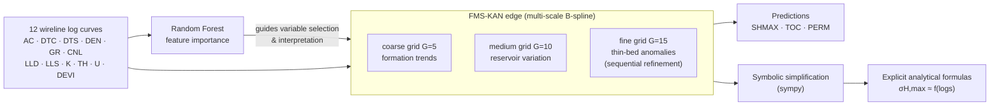

# FMS-KAN for Well-Logging Knowledge Discovery

**A Feature-guided Multi-Scale Kolmogorov–Arnold Network for *interpretable* prediction of in-situ stress and reservoir parameters from wireline logs — models you read as equations, not just query as black boxes.**

[](#project-status)
[](LICENSE)
[](https://www.python.org/)
[](https://pytorch.org/)
[](#data--ethics)
[](#reproduction)

> **What this repo is.** The code and the full de-identified four-well dataset for the FMS-KAN paper (under review). It reproduces the modeling pipeline end-to-end and the study's qualitative results. This is a research snapshot, not a production library — see [Project Status](#project-status).

---

## Architecture at a Glance



Two design choices separate FMS-KAN from a standard KAN:

1. **Multi-scale B-spline adaptation** — every edge is progressively refined coarse→medium→fine (*G* = 5 → 10 → 15) via pykan grid refinement, so one model captures formation-level trends, reservoir-level variation, and thin-bed anomalies in a single coarse-to-fine schedule. This is **sequential grid refinement**, not a parallel softmax fusion of three branches.
2. **Feature-importance analysis** — tree-based (Random Forest) feature importances identify the physically dominant curves per target and guide variable selection for the symbolic formulas; the ranking is reported alongside the extracted-formula variables as a cross-check.

Because a KAN is a sum of learned univariate functions, the trained network can be **symbolically simplified into explicit equations** — the property this project exists to demonstrate.

---

## Table of Contents

- [Architecture at a Glance](#architecture-at-a-glance)
- [Key Results](#key-results)
- [Interpretability: A Formula You Can Read](#interpretability-a-formula-you-can-read)
- [Repository Structure](#repository-structure)
- [Installation](#installation)
- [Quickstart](#quickstart)
- [Reproduction](#reproduction)
- [Data & Ethics](#data--ethics)
- [Project Status](#project-status)
- [Contributing & Contact](#contributing--contact)
- [Citation](#citation)
- [Authors](#authors)
- [License](#license)

---

## Key Results

Test-set **R²** on a single pooled 70/15/15 train/validation/test split (`random_state=42`). Every model shares identical features, standardization, and split.

| Target   | Linear | Poly-3 | Random Forest | MLP   | Std. KAN | **FMS-KAN** |
|----------|:------:|:------:|:-------------:|:-----:|:--------:|:-----------:|
| SHMAX    | 0.900  | 0.985  | 0.997         | 0.988 | 0.973    | **0.996**   |
| TOC      | 0.837  | 0.937  | 0.967         | 0.973 | 0.947    | **0.973**   |
| PERM     | < 0    | 0.830  | 0.966         | 0.890 | 0.981    | **0.974**   |
| **Mean** | —      | 0.917  | 0.977         | 0.950 | 0.967    | **0.981**   |

On this pooled split FMS-KAN attains the **highest mean R² (0.981)**; it **leads on TOC and PERM** over the black-box baselines and is **statistically level with the strongest black box (Random Forest) on SHMAX** (0.996 vs. 0.997). The `Std. KAN` column is a **paired ablation** — a single-scale KAN (`G=15`) with the *same* width, optimizer, and training budget as FMS-KAN, so the FMS-KAN → Std. KAN gap isolates the effect of multi-scale grid refinement alone (mean **+0.014**). Its decisive, consistent margin is over the **traditional** baselines (linear/polynomial). `train_pooled.py` also evaluates Gradient Boosting (GBDT); the table reports the strongest baseline per family, and the full comparison is regenerated by the script (see [Reproduction](#reproduction)).

> **How to read these numbers.** They are point estimates from **one** pooled random split. Well-log samples are spatially and depth-correlated, so a pooled split can be optimistic — treat these values as an *upper-bound* generalization estimate, **not** a leave-one-well-out (LOWO) claim. They carry **no confidence intervals** (single seed, single split). For the geoscience-credible out-of-distribution test, use `train_lowo.py`, which withholds an entire well at a time. Per-target RMSE/MAE in physical units (MPa, wt%, mD) and per-well breakdowns are written to `final_error_table.csv` and `r2_per_well.json` by the pipeline rather than hand-copied here.

**Released dataset sample counts** (rows per well in `data/`; target columns contain depth-dependent gaps):

| Well      |    Rows |
|-----------|--------:|
| Well A    |   2,691 |
| Well B    |   4,211 |
| Well C    |   3,575 |
| Well D    |   1,144 |
| **Total** | **11,621** |

---

## Interpretability: A Formula You Can Read

The point of FMS-KAN is that a fitted model is not a weight tensor but an **equation**. The closed-form formula is extracted **from the same FMS-KAN that produces the accuracy numbers above** — the model is pruned and symbolically fitted in place (pykan `auto_symbolic`, see `extract_final.py`), not re-fitted as a separate small network. The TOC head reduces to a compact sum of univariate terms:

```
TOC  ≈  c0
     +  f_U(U)              # uranium — dominant term
     -  f_DEN(DEN)          # bulk density
     +  f_DTC(DTC)          # compressional transit time
     -  f_CNL(CNL)          # neutron porosity
     +  …                   # remaining low-magnitude linear terms
```

Each `f_x(·)` is a low-order spline or elementary function whose exact coefficients are emitted by `extract_final.py`. **Two accuracy levels must be distinguished honestly:** the full *continuous* FMS-KAN (12 original wireline features) reaches R² ≈ 0.973 on TOC, whereas its *symbolically simplified closed form* (elementary library `x, x², x³, tanh`) is a deliberately compact approximation that trades accuracy for readability — the **TOC** head reduces to a stable, reproducible 12-term linear form at R² ≈ **0.837**, whose dominant variables (U, DEN, DTC, CNL) match the Random-Forest importance ranking.

**Honest boundary of the current library.** For **SHMAX** and **PERM** the *continuous* FMS-KAN is highly accurate (R² ≈ 0.996 / 0.974, see the table), but a *compact* symbolic closed form is **not stably extractable** under the elementary library: SHMAX tends to collapse into a long high-order interaction expression and PERM's symbolic fit gives R² < 0. pykan's symbolic fitting is also stochastic run-to-run for these targets, so `extract_final.py` honestly **downgrades** them and keeps the numerical KAN model instead of forcing a formula. `extract_final.py` fixes seeds and single-threads (`set_num_threads(1)`) and patches a `curve2coef` crash in pykan for best-effort reproducibility; low-magnitude TOC coefficients may still wiggle in the last decimal. The formulas are produced by `extract_final.py` and are not committed as static text, so they always match the code that generated them.

---

## Repository Structure

The tree below matches `ls` exactly — every file referenced in [Reproduction](#reproduction) exists.

```
FMS-KAN-well-logging/
├── README.md
├── requirements.txt
├── .gitignore
├── code/
│   ├── prepare_clean.py        # bridge: data/Well*.csv → code/clean/*.csv (RUN THIS FIRST)
│   ├── build_dataset.py        # raw well logs → cleaned tables (restricted raw logs; NOT runnable from public subset)
│   ├── train_pooled.py         # pooled 70/15/15 split, seven-model comparison table
│   ├── fms_kan.py              # FMS-KAN multi-scale (G=5→10→15 refinement) vs. standard KAN
│   ├── finalize_pipeline.py    # train final FMS-KAN + paired Std.KAN, export predictions, weights & per-well CSVs
│   ├── extract_final.py        # symbolic closed-form extraction from the final FMS-KAN itself (pykan auto_symbolic)
│   ├── ablation_paired.py      # paired ablation: single-scale Std.KAN vs multi-scale FMS-KAN (same width/optimizer/budget)
│   ├── train_lowo.py           # leave-one-well-out (OOD) generalization comparison
│   ├── optimize_scan.py        # optimizer / regularization / grid recipe scan
│   ├── compute_perwell.py      # per-well R² for baselines (figures)
│   └── regenerate_v2.py        # regenerate all paper figures
└── data/
    ├── WellA.csv               # de-identified subset — DEPTH + 12 log features + SHMAX/TOC/PERM
    ├── WellB.csv
    ├── WellC.csv
    └── WellD.csv
```

---

## Installation

**Tested environment:** Python **3.10**, Linux/macOS, CPU-only. A GPU is optional — the KAN runs on CPU by default, and the full pipeline completes in minutes on a modern laptop.

```bash
python -m venv .venv && source .venv/bin/activate
pip install -r requirements.txt
```

Core dependencies (`requirements.txt`; versions currently unpinned — pin them in your fork for byte-level reproducibility):

| Package           | Role                                        |
|-------------------|---------------------------------------------|
| `torch` (2.x)     | KAN backend                                 |
| `pykan`           | Kolmogorov–Arnold Network + grid refinement |
| `scikit-learn`    | baselines, scaling, split                   |
| `sympy`           | symbolic simplification of the trained KAN  |
| `pandas`, `numpy` | data handling                               |
| `matplotlib`      | figures                                     |
| `pyyaml`          | config I/O                                  |

---

## Quickstart

Under one minute — load the released subset and confirm it parses:

```bash
python - <<'PY'
import pandas as pd, glob
for f in sorted(glob.glob("data/Well*.csv")):
    df = pd.read_csv(f)
    print(f, df.shape, "targets:", [c for c in ("SHMAX","TOC","PERM") if c in df])
PY
```

Expected output — four wells, 16 columns each (DEPTH + 12 features + 3 targets):

```
data/WellA.csv (2691, 16) targets: ['SHMAX', 'TOC', 'PERM']
data/WellB.csv (4211, 16) targets: ['SHMAX', 'TOC', 'PERM']
data/WellC.csv (3575, 16) targets: ['SHMAX', 'TOC', 'PERM']
data/WellD.csv (1144, 16) targets: ['SHMAX', 'TOC', 'PERM']
```

---

## Reproduction

The modeling scripts read internally-named tables under `code/clean/`. The public release ships the de-identified `data/Well*.csv` instead, so **run `prepare_clean.py` first** — it bridges the released tables into the `code/clean/` layout the scripts expect. `build_dataset.py` documents the raw-log → clean-table step, operates on the **restricted raw LAS logs**, and is **not** runnable from the released tables alone (the released `data/Well*.csv` are already its output).

```bash
# 0. Environment (see Installation) — Python 3.10, seed fixed to 42
source .venv/bin/activate

# 1. Bridge the released subset into the clean/ layout the scripts expect
python code/prepare_clean.py

# 2. Seven-model pooled comparison → reproduces the Key Results table
python code/train_pooled.py

# 3. Train the final FMS-KAN + paired Std.KAN; export predictions, weights & per-well CSVs
python code/finalize_pipeline.py

# 4. Extract symbolic closed-form formulas from the final FMS-KAN itself (SHMAX / TOC; PERM kept numerical)
python code/extract_final.py

# 5. Paired multi-scale ablation (single-scale Std.KAN vs multi-scale FMS-KAN)
python code/ablation_paired.py

# 6. Leave-one-well-out (OOD) generalization — the geoscience-credible test
python code/train_lowo.py

# 7. Regenerate all paper figures
python code/regenerate_v2.py
```

**Expected outputs and how to verify them**

| Step                   | Writes                                                                                                                                        | Self-check                                                                                                                                            |
|------------------------|---------------------------------------------------------------------------------------------------------------------------------------------|-----------------------------------------------------------------------------------------------------------------------------------------------------|
| `train_pooled.py`      | comparison table under `code/_run/`                                                                                                          | FMS-KAN mean R² ≈ **0.981**                                                                                                                          |
| `finalize_pipeline.py` | `code/models/<TARGET>_fmskan.pt`, `code/data_desensitized_v2/<Well>/<TARGET>/data.csv`, `final_error_table.csv`, `r2_per_well.json` | pooled test R² mean ≈ 0.981; a **built-in Random-Forest sanity assertion** (SHMAX RF R² ≈ 0.998) aborts the run if the split silently regresses. **Caveat:** the per-well values in `r2_per_well.json` are computed over each well's *full* valid samples (train+val+test), i.e. a per-well reconstruction, not a per-well held-out test score |
| `train_lowo.py`        | per-fold LOWO R² table + detail CSV                                                                                                          | per-well R², reported honestly (expect lower than pooled)                                                                                            |
| `regenerate_v2.py`     | figures (predicted-vs-true panels, per-well heatmaps)                                                                                        | one `.png` per target                                                                                                                                |

Runtime is on the order of minutes on CPU. Intermediate directories (`_run/`, `model/`) are git-ignored. **If any step exits non-zero or the RF sanity assertion fires, the reproduction has not succeeded — do not trust the numbers.**

---

## Data & Ethics

**Released data (this repository).** `data/WellA–D.csv` is the **full, de-identified** four-well wireline-log dataset (all valid depth samples), released with the **data provider's authorization** for the sole purpose of reproducing this study.

- **Anonymization.** Well identities are replaced with neutral labels (Well A–D) and internal well IDs are stripped. The released tables contain the full depth-continuous logs (absolute depth, 12 wireline curves, three targets) and are the exact data behind the paper's reported numbers and figures.
- **Raw logs.** Only the cleaned, de-identified tables are distributed. The original LAS files and any provider-identifying metadata remain confidential; `build_dataset.py` documents the raw-log → clean-table step for holders of the controlled raw data.
- **Licensing.** The **code** is MIT-licensed (see [License](#license)). The **data** is **not** MIT — it is provided for research reproduction under the provider's authorization only, with **no redistribution** and no commercial use. Treat `data/` and `code/` as separately licensed.
- **Provenance / citation.** The dataset is not assigned a public DOI. Cite this repository and the paper (see [Citation](#citation)) when using the data.
- **Access to the full data / provider identity.** Requests are handled case by case, subject to provider approval — contact the corresponding author (see [Contributing & Contact](#contributing--contact)).

---

## Project Status

- **Stage:** research snapshot accompanying a manuscript **under review** (2026). Interfaces and script layout may change until acceptance.
- **Preprint / DOI:** not yet available. A preprint link and archival DOI will be added here on release; until then, this repository is the only stable identifier to cite.
- **Scope:** reproduces the paper's pipeline and qualitative results on the released subset. It is not maintained as a general-purpose KAN library.

---

## Contributing & Contact

- **Issues:** open a GitHub issue for reproduction problems (include OS, Python version, and the failing command's full traceback).
- **Pull requests:** small, focused PRs are welcome — bug fixes, documentation, and pinned-dependency contributions especially. Keep the code and data licensing boundaries intact, and never add restricted data to the history.
- **Data access & scientific correspondence:** Yongan Zhang — `yongan.zhang@connect.polyu.hk`.

---

## Citation

If you use this code or the released subset, please cite both the repository and the manuscript. The BibTeX below is provisional (paper under review); update the key and venue once accepted or preprinted.

```bibtex
@misc{gong_fmskan_2026_repo,
  title        = {FMS-KAN for Well-Logging Knowledge Discovery (code and de-identified subset)},
  author       = {Gong, An and Qi, Zhenpeng and Zhang, Yongan and
                  Li, Yizheng and Sun, Youzhuang and Liu, Mingyu},
  year         = {2026},
  howpublished = {GitHub repository},
  note         = {Research snapshot; manuscript under review}
}

@article{gong_fmskan_2026,
  title   = {Feature-guided Multi-Scale Kolmogorov--Arnold Network for
             Knowledge Discovery of In-situ Stress and Reservoir Parameters},
  author  = {Gong, An and Qi, Zhenpeng and Zhang, Yongan and Li, Yizheng
             and Sun, Youzhuang and Liu, Mingyu},
  journal = {Manuscript under review},
  year    = {2026}
}
```

---

## Authors

**An Gong**¹, **Zhenpeng Qi**¹, **Yongan Zhang**²ʼ³ (corresponding), **Yizheng Li**²ʼ³, **Youzhuang Sun**¹, **Mingyu Liu**⁴

1. College of Computer Science and Technology, China University of Petroleum (East China), Qingdao, China
2. State Key Laboratory of Climate Resilience for Coastal Cities, Department of Building Environment and Energy Engineering, The Hong Kong Polytechnic University, Hong Kong SAR, China
3. Zhejiang Key Laboratory of Industrial Intelligence and Digital Twin, Eastern Institute of Technology, Ningbo, China
4. Department of Physics, Colorado State University, Fort Collins, CO, USA

**Corresponding author:** Yongan Zhang — `yongan.zhang@connect.polyu.hk`

---

## License

- **Code:** released under the [MIT License](LICENSE).
- **Data (`data/`):** released only for research reproduction under the data provider's authorization — no redistribution, no commercial use. See [Data & Ethics](#data--ethics).
